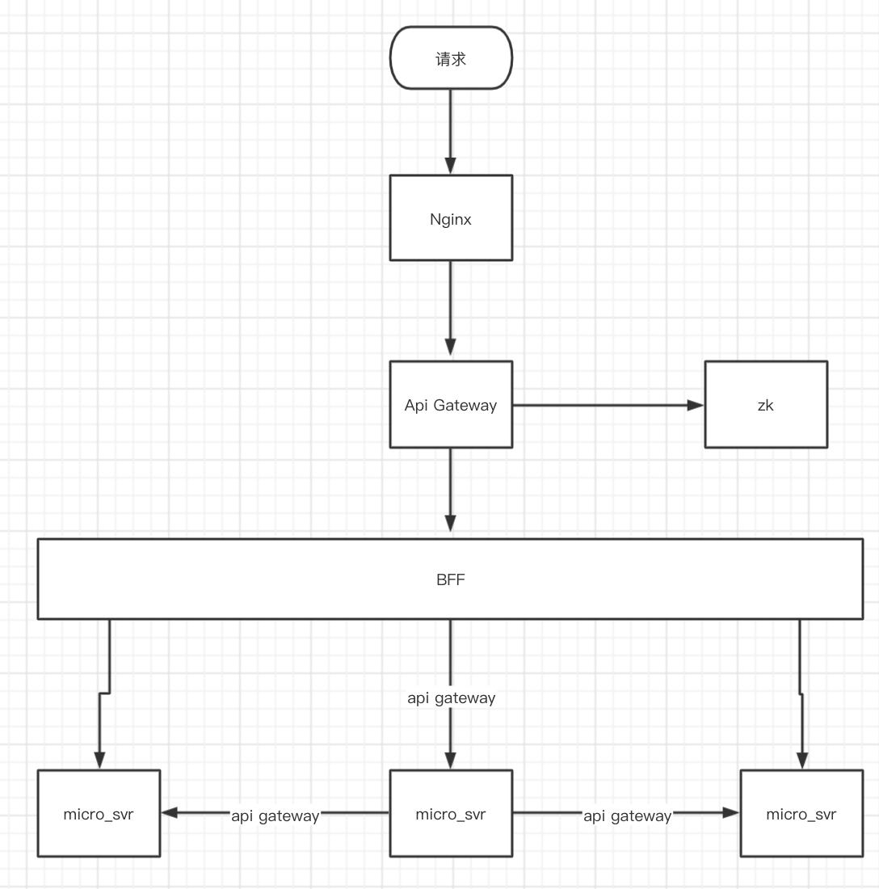

# total

我们主要维护的项目是平台端的，对外有一个开放平台，对内有一个运营平台
之前是php实现的，页面就是html嵌套部分php代码直出
现在是采用vue+go的方式 前后端分离

大概是这样的

- 所有的接口请求都会通过网关转发，所以一个服务要能被找到，必须先在网关注册
- 网关通过监听zk临时节点的变化实现服务注册
- BFF层是CGI接入层，主要处理业务相关的逻辑及数据整合
- micro_svr 尽量可能的与业务无关

我们微服务的划分主要是根据业务职能，比如开放平台有自己的微服务，运营平台有自己的微服务。当然还有一些功能性的服务，比如通用的下载功能，是一个单独的服务

微服务之间的相互调用也会通过网关转发，所以网关是一个热点

网关做的事情包括超时控制，限频，鉴权 以及不同环境的转发